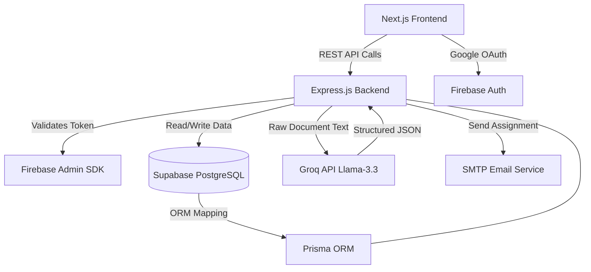

# 🏛️ VedaAI System Architecture & Design

Welcome to the brains of the operation! This document lays out the **High-Level Design (HLD)** and **Low-Level Design (LLD)** of VedaAI. 

We’ve kept it professional, but human enough so you don't fall asleep reading it. Grab a coffee, let's dive into how we turn boring PDFs into formatted exams using the magic of AI.

---

## 🏗️ High-Level Design (HLD)

The system is built on a modern decoupled architecture. We have a shiny Next.js frontend talking to a robust Express.js backend, which in turn orchestrates data between our PostgreSQL database and the Groq AI engine.

### The 10,000-Foot View



### Key Components:
1. **The Client (Frontend):** 
   - Built with **Next.js**. It handles all the UI, animations, and state. When a teacher uploads a document, the client packs it into a `FormData` object and fires it off to the backend.
2. **The API (Backend):** 
   - A Node/Express server acting as the traffic cop. It protects routes using custom JWTs, handles file uploads via `multer`, and runs heavy processing tasks (like OCR).
3. **The Brain (AI Integration):**
   - We use the **Groq SDK** to talk to `llama-3.3-70b-versatile`. We feed it heavily prompted instructions requiring it to output strict, structured JSON.
4. **The Vault (Database):**
   - **PostgreSQL** hosted on Supabase, managed entirely by the **Prisma ORM** for type-safe queries.

---

## 🔬 Low-Level Design (LLD)

Let's zoom in and see how the gears actually turn when a user does something.

### 1. The Authentication Flow (Who are you?)
We didn't want to reinvent the wheel, so we used Firebase for Google Logins, but we wanted our *own* JWTs for the backend. 
- **The Flow:**
  1. User clicks "Login with Google". Frontend uses Firebase SDK to get a Firebase ID Token.
  2. Frontend POSTs this token to `/api/auth/google`.
  3. Backend uses `firebase-admin` to verify the token.
  4. Backend checks if the user exists in PostgreSQL (via Prisma). If not, creates them.
  5. Backend signs its *own* custom JWT using `jsonwebtoken` and sends it back to the client.
  6. Frontend stores it in a cookie and uses it for all future API calls.

### 2. The Document Processing Flow (The Heavy Lifting)
This is where the magic happens. A teacher uploads a syllabus, and we need to spit out an exam.
- **Step-by-Step:**
  1. **Upload:** File hits `/api/generate`. `multer` saves it temporarily to the `/uploads` folder.
  2. **Parsing:** We check the MIME type in `llmService.ts`:
     - If it's a PDF -> Use `pdf-parse` to extract raw text.
     - If it's an Image -> Use local `Tesseract.js` OCR to extract text *(Note: Can take 5-15s, CPU heavy)*.
  3. **Context Truncation:** We chop the text to ~15,000 characters to avoid blowing up the LLM context window.
  4. **The Prompt:** We inject the text, the requested number of questions, and the total marks into a massive system prompt that demands a very specific JSON schema.
  5. **The Generation:** Groq returns the JSON. We parse it, save it as a stringified field in the `Assignment` table, and send it back to the frontend.

### 3. Database Schema (Prisma)
Our data model is clean and relational.

```prisma
model User {
  id           String       @id @default(uuid())
  email        String       @unique
  name         String?
  assignments  Assignment[]
  groups       Group[]
}

model Assignment {
  id          String   @id @default(uuid())
  title       String
  paperJson   String?  // The magical AI output
  userId      String?
  user        User?    @relation(fields: [userId], references: [id])
}

model Group {
  id          String   @id @default(uuid())
  name        String
  emails      String   // Stored as a JSON string array
  userId      String
  user        User     @relation(fields: [userId], references: [id])
}
```

### 4. Group Management & Email Dispatching
Because teachers shouldn't have to copy-paste 30 emails manually.
- **Storage:** Group emails are stored as a stringified JSON array in the `Group` table to keep the schema simple and avoid complex joins for simple lists.
- **Dispatch:** When a teacher clicks "Send to Group", the backend pulls the emails, parses them, and loops them into `nodemailer`. We generate a neat little HTML template and attach the assignment. 

---

## 🚀 Deployment Architecture

When you deploy this app, it physically splits into three pieces across the internet:
1. **Frontend Host (e.g., Vercel):** Serves the static Next.js files and handles Next API proxies (`next.config.ts` rewrites `/api/*` to the backend).
2. **Backend Host (e.g., Render/Heroku):** Runs the Express server. Must have environment variables set up, including the `DATABASE_URL` pointing to the connection pooler.
3. **Database (Supabase):** Handles the Postgres instance. Because we use Prisma in a server environment, we connect via port `6543` (Transaction Pooler) with `?pgbouncer=true` to handle concurrent connections gracefully without blowing up the DB.

---
*End of Document. If the system goes down, did you try turning it off and on again?*
